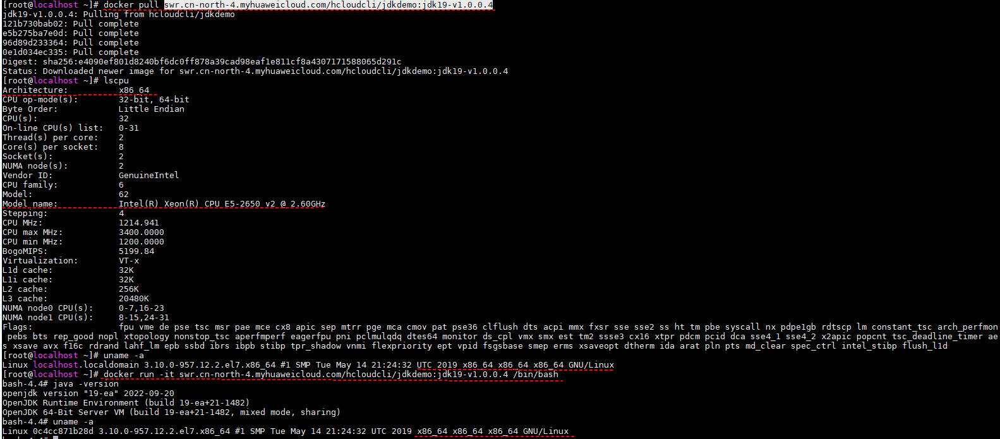
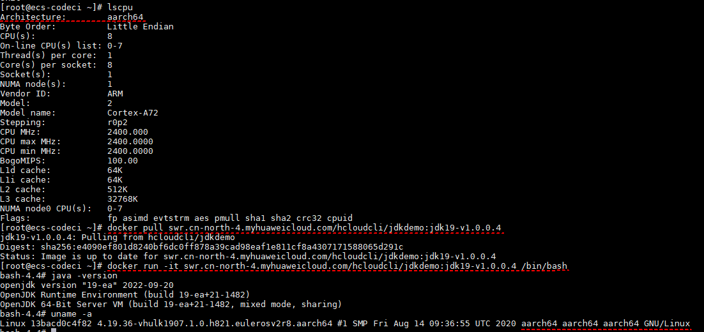
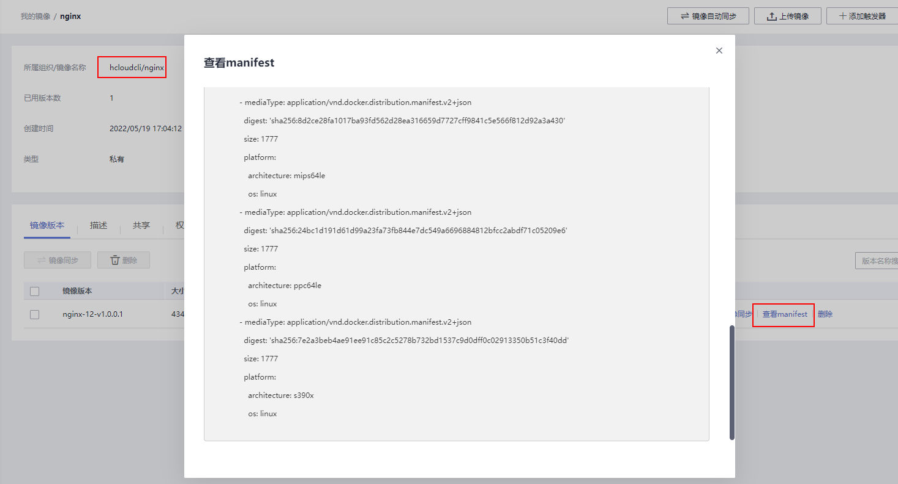

# swr-multiplatform-build-action
允许用户构建跨平台镜像,如linux平台，windows平台或macos平台，并可以直接推送到SWR等Docker镜像仓库上  
目前支持的平台列表如下  
```yaml
  'linux/amd64',
  'linux/arm64',
  'linux/ppc64le',
  'linux/s390x',
  'linux/386',
  'linux/arm/v5',
  'linux/arm/v7',
  'linux/arm/v6',
  'linux/arm64/v8',
  'linux/mips64le',
  'windows/amd64',
  'windows/arm64',
  'darwin/amd64',
  'darwin/arm64'
```

## **前置工作**
(1).如果项目代码需要打包，需要提前完成打包动作，并修改Dockerfile
(2).如果需要推送到SWR等Docker registry上，需要添加一个docker login的action，添加好登录账号密码等信息    
(3).需要确定基础镜像支持的平台，可以登录dockerhub官网查看  
如19-jdk,支持windows/amd64,linux/amd64,linux/arm64/v8 这三个平台,  


## **参数说明:**
image_tag:需要打包的docker镜像标签，必填，如   swr.cn-north-4.myhuaweicloud.com/hcloudcli/jdkdemo:jdk19-v1.0.0.4  
platforms: 当前需要打包支持的平台，用逗号隔开，如  linux/amd64,linux/arm64/v8,windows/amd64，非必填，如果不填写的话，会默认打包当前环境所在的平台，如ubuntu-latest所在的linux/amd64  
file: Dockerfile路径，默认为Dockerfile,如果在其他目录，则填写相对路径或者绝对路径,如 ./dockerfiles/Dockerfile  
use_latest_buildx: 是否需要使用最新版本的docker buildx来构建docker镜像,如果为true,会比较当前安装的buildx和官方发布的最新版本，有差异的话会安装最新版本  
push: 是否需要将构建好的镜像推送到docker镜像仓库，如果填true，需要再前面增加一个docker login的  action完成镜像仓库的登录，在构建完成之后会自动推送到华为云SWR  

## **使用样例**
### 1、简单样例，只构建代码和打包镜像
步骤说明如下  
(1)、完成jdk安装和java项目打包  
(2)、填写image_tag参数，镜像会工具当前环境所在的平台，打包出一个 linux/amd64的镜像
```yaml
    # 安装JDK和maven
    - name: Set up JDK 19 for maven build
      uses: actions/setup-java@v1
      with:
        java-version: 19

    # 完成java项目打包
    - name: build maven project
      run: mvn clean -U package -Dmaven.test.skip
      
    # 完成docker镜像打包
    - name: "build springcloud demo for linux/amd64"
      uses: huaweicloud/swr-multiplatform-build-action@v1.0.0
      with:
        image_tag: swr.cn-north-4.myhuaweicloud.com/hcloudcli/jdkdemo:jdk19-v1.0.0.4
```
详情可参考 ./github/workflow/build-local-for-test.yml  

### 2、普通样例，完成镜像的windows和linux平台构建，并上传到swr
步骤说明如下  
(1)、完成jdk安装和java项目打包  
(2)、设置docker login，填写AK和SK，完成华为云SWR容器镜像服务的登录
(3)、设置docker buildx，可以选配，插件会检查当前环境是否安装了docker buildx,如果没有的话，会自动安装
(4)、登录doocker hub，查看openjdk镜像，可以看到openjdk:19-jdk 支持  linux/amd64,linux/arm64/v8,windows/amd64三个平台，因此platforms参数可以填写这三个中的一个或多个，也可以填写全部。push参数填写为true，即打包完之后就push到华为云SWR

```yaml
    # 安装JDK和maven
    - name: Set up JDK 19 for maven build
      uses: actions/setup-java@v1
      with:
        java-version: 19

    # 完成java项目打包
    - name: build maven project
      run: mvn clean -U package -Dmaven.test.skip 

    # docker login,设置登陆到华为的swr
    - name: Log in to HuaweiCloud SWR
      uses: huaweicloud/swr-login@v1
      with:
      region: cn-north-4
      access-key-id: ${{ secrets.ACCESSKEY }}
      access-key-secret: ${{ secrets.SECRETACCESSKEY }}
    # 设置 docker 环境
    - name: Set up Docker Buildx
      id: buildx
      uses: docker/setup-buildx-action@v1
      
    # 完成docker镜像打包，支持linux/amd64,linux/arm64/v8,windows/amd64三个平台
    - name: "build springcloud demo for linux/amd64,linux/arm64/v8,windows/amd64"
      uses: huaweicloud/swr-multiplatform-build-action@v1.0.0
      with:
        image_tag: swr.cn-north-4.myhuaweicloud.com/hcloudcli/jdkdemo:jdk19-v1.0.0.4
        platforms: linux/amd64,linux/arm64/v8,windows/amd64
        use_latest_buildx: false
        push: true
        file: ./Dockerfile
```
详情可参考 ./github/workflow/build-springclouddemo-for-multiplatform.yml  
### 3、复杂样例，完成镜像的复杂多平台构建，并上传到swr
步骤说明如下   
(1)、设置docker login，填写AK和SK，完成华为云SWR容器镜像服务的登录
(2)、登录doocker hub，查看openjdk镜像，可以看到openjdk:19-jdk 支持  linux/386,linux/amd64,linux/arm/v5,linux/arm/v7,linux/arm64/v8,linux/mips64le,linux/ppc64le,linux/s390x 平台，因此platforms参数可以填写些平台中的一个或多个，也可以填写全部。push参数填写为true，即打包完之后就push到华为云SWR
(3)、file参数指定Dockerfile的路径,此处为./dockerfiles/Dockerfile-nginx

```yaml
    # docker login,设置登陆到华为的swr
    - name: Log in to HuaweiCloud SWR
      uses: huaweicloud/swr-login@v1
      with:
      region: cn-north-4
      access-key-id: ${{ secrets.ACCESSKEY }}
      access-key-secret: ${{ secrets.SECRETACCESSKEY }}

    # 完成docker镜像打包，支持多个平台
    - name: "build nginx image for linux/386,linux/amd64,linux/arm/v5,linux/arm/v7,linux/arm64/v8,linux/mips64le,linux/ppc64le,linux/s390x"
      uses: huaweicloud/swr-multiplatform-build-action@v1.0.0
      with:
        image_tag: swr.cn-north-4.myhuaweicloud.com/hcloudcli/nginx:nginx-12-v1.0.0.1
        platforms: linux/386,linux/amd64,linux/arm/v5,linux/arm/v7,linux/arm64/v8,linux/mips64le,linux/ppc64le,linux/s390x
        use_latest_buildx: true
        push: true
        file: ./dockerfiles/Dockerfile-nginx
 ```
 详情可参考 ./github/workflow/build-nginx-for-multiplatform.yml  
 
## **打包查看结果**
### 1、jdkdemo:jdk19-v1.0.0.4镜像
登录华为云SWR服务，查看hcloudcli/jdkdemo:jdk19-v1.0.0.4镜像的manifast内容  
```yaml
digest: sha256:e4090ef801d8240bf6dc0ff878a39cad98eaf1e811cf8a4307171588065d291c
manifest详情：
mediaType: application/vnd.docker.distribution.manifest.list.v2+json
schemaVersion: 2
manifests:
  - mediaType: application/vnd.docker.distribution.manifest.v2+json
    digest: 'sha256:231dfe58054c8f02f1a67ad29463a7c17f9ef67b02208b983b9ff9c0eb9cc891'
    size: 1161
    platform:
      architecture: amd64
      os: linux
  - mediaType: application/vnd.docker.distribution.manifest.v2+json
    digest: 'sha256:8161e616a3533a77e695b3af89ff53b9120192c6e98a8892270ada7ab325bcb7'
    size: 1161
    platform:
      architecture: arm64
      os: linux
  - mediaType: application/vnd.docker.distribution.manifest.v2+json
    digest: 'sha256:562edc71575aa6602ed353a0bc4bea1faac540ef37ea1c0aac96b1bab337842f'
    size: 2833
    platform:
      architecture: amd64
      os: windows
 ```
 效果截图如下
 
 
 ### **镜像使用:**
 在linunx或者windows的x86-64平台或者linux的arm-64平台，直接docker pull这个镜像，docker会自动下载对应平台的镜像  
#### (1)、linux x86-64平台

#### (2)、linux arm-64平台:
 
#### (3)、windows x86-64平台 
 
 
 ### 2、nginx:nginx-12-v1.0.0.1镜像
 登录华为云SWR服务，查看hcloudcli/nginx:nginx-12-v1.0.0.1镜像的manifast内容  
```yaml
manifest详情：
mediaType: application/vnd.docker.distribution.manifest.list.v2+json
schemaVersion: 2
manifests:
  - mediaType: application/vnd.docker.distribution.manifest.v2+json
    digest: 'sha256:70e174bc7c8292c14f30a3d0ada29320ae6c74e3ab898f9b6afcb5fd75d3c45d'
    size: 1777
    platform:
      architecture: '386'
      os: linux
  - mediaType: application/vnd.docker.distribution.manifest.v2+json
    digest: 'sha256:8a338905d951ada843f5da94d0fc74b1a5774adfc2cd02ca829375a1be03bae2'
    size: 1777
    platform:
      architecture: amd64
      os: linux
  - mediaType: application/vnd.docker.distribution.manifest.v2+json
    digest: 'sha256:d218e1ca90c0379f95f8da392e2c262dfd5f05000ff1323375eb431bdedb3232'
    size: 1777
    platform:
      architecture: arm
      os: linux
      variant: v5
  - mediaType: application/vnd.docker.distribution.manifest.v2+json
    digest: 'sha256:24a7fb035d51a69ff01bd3536bc223583eb4b7d403035711f96c6a7a91275380'
    size: 1777
    platform:
      architecture: arm
      os: linux
      variant: v7
  - mediaType: application/vnd.docker.distribution.manifest.v2+json
    digest: 'sha256:71325ee689517cc060c21872e3a340b8796aa468525e24f2c8b23543418a309c'
    size: 1777
    platform:
      architecture: arm64
      os: linux
  - mediaType: application/vnd.docker.distribution.manifest.v2+json
    digest: 'sha256:8d2ce28fa1017ba93fd562d28ea316659d7727cff9841c5e566f812d92a3a430'
    size: 1777
    platform:
      architecture: mips64le
      os: linux
  - mediaType: application/vnd.docker.distribution.manifest.v2+json
    digest: 'sha256:24bc1d191d61d99a23fa73fb844e7dc549a6696884812bfcc2abdf71c05209e6'
    size: 1777
    platform:
      architecture: ppc64le
      os: linux
  - mediaType: application/vnd.docker.distribution.manifest.v2+json
    digest: 'sha256:7e2a3beb4ae91ee91c85c2c5278b732bd1537c9d0dff0c02913350b51c3f40dd'
    size: 1777
    platform:
      architecture: s390x
      os: linux
 ```
 效果截图如下
 